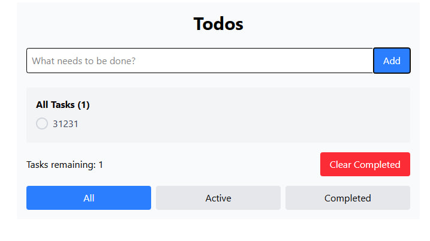

#  + 

# Тестовое задание Frontend intern в Mindbox

## Сделайте ToDo-приложение, позволяющее управлять текущим списком дел

### Что должно быть в интерфейсе:

### Поле для ввода новой задачи

### Списки задач: 1. общий 2. невыполненные 2. выполненные

### Количество оставшихся

### Очистка выполненных

## Требования к коду:

### Приложение создано с использованием TypeScript, React и React Hooks

### Библиотеки компонент – на ваше усмотрение

### Ключевая на ваш взгляд функциональность обязательно покрыта тестами

### Проект запускается npm run start, как указано в ТЗ (но оставил и npm run dev, потому что это Vite)

## Тесты сделаны через vitest и запускаются через:

### npm test и npm run test (watch или разовый запуск)

### npm run coverage (отчёт по покрытию тестами)

# [Смотреть демо](https://test-mindbox-todo.vercel.app/)
